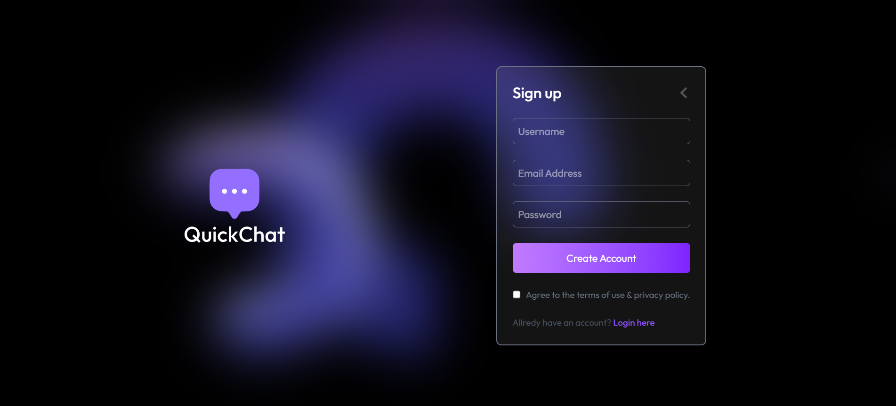
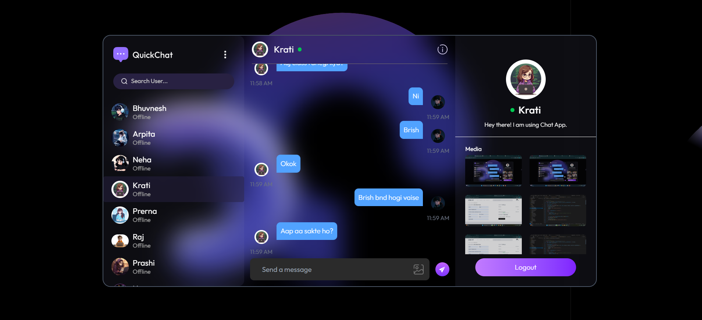

# Chat App

> A full-stack, real-time one-to-one messaging application built with the **MERN stack** and **Socket.IO**.


A real-time messaging app where users can register, authenticate via HTTP-only cookies, chat one-on-one, share images, and see live online presence — backed by MongoDB and Socket.IO for instant message delivery.

---

## Project Overview

This project is a monorepo-style application with separate `client/` (React + TypeScript) and `server/` (Node.js + Express) directories. The backend exposes a REST API for authentication, user profiles, and message history, while Socket.IO handles real-time events such as online user tracking and instant message broadcasting. Media uploads (profile avatars and chat images) are processed in-memory with Multer and stored on Cloudinary.

The UI is a responsive three-panel chat layout: a searchable user sidebar, a conversation view, and a contact details panel with shared media.

---

## Highlights

- **Real-time messaging** with Socket.IO — instant delivery, online presence, unread-count badges, and read receipts.
- **Secure authentication** using bcrypt password hashing and JWT stored in HTTP-only cookies.
- **Image messaging** — text and/or photo messages plus profile avatars streamed to Cloudinary via Multer (in-memory).
- **Responsive three-panel UI** (contacts / conversation / shared media) built with React 19 and Tailwind CSS.
- **Clean architecture** — REST API + WebSocket separation, React Context for state, and reusable, typed components.

---

## Screenshots

> _Add screenshots of the login, chat, and profile pages here. Place images in `docs/` or `assets/screenshots/` and reference them as shown below._

```markdown


```

---

## Key Features

| Feature | Implementation |
|---|---|
| **User registration & login** | Email/password auth with bcrypt hashing and JWT stored in HTTP-only cookies |
| **Protected routes** | Client-side route guards + server-side `isLoggedin` middleware on all private endpoints |
| **One-to-one messaging** | Text and/or image messages between any two registered users |
| **Real-time delivery** | Socket.IO pushes `newMessage` events to sender and receiver sockets |
| **Online presence** | In-memory `userSocketMap` tracks connected users; sidebar shows Online/Offline status |
| **Read receipts** | `seen` boolean on messages; auto-marked when a conversation is opened |
| **Unread counts** | Per-user badge in the sidebar for unseen incoming messages |
| **Conversation sorting** | Sidebar users ordered by most recent message timestamp |
| **User search** | Client-side filter by username in the sidebar |
| **Profile management** | Update username, bio, and avatar image |
| **Shared media gallery** | Right sidebar displays all images from the active conversation |
| **Responsive layout** | Mobile-friendly panel switching with Tailwind CSS breakpoints |

---

## Tech Stack

### Frontend (`client/`)

| Technology | Purpose |
|---|---|
| React 19 | UI framework |
| TypeScript | Type-safe components and context |
| Vite 8 | Dev server and production bundler |
| React Router 8 | Client-side routing (`/`, `/login`, `/profile`) |
| Tailwind CSS 4 | Utility-first styling (`@tailwindcss/vite` plugin) |
| Axios | HTTP client with `withCredentials` for cookie-based auth |
| Socket.IO Client | Real-time WebSocket connection to the server |
| React Hot Toast | Success/error notifications |
| Day.js | Message timestamp formatting |

### Backend (`server/`)

| Technology | Purpose |
|---|---|
| Node.js (ES Modules) | Runtime |
| Express 5 | REST API server |
| MongoDB + Mongoose 9 | Document database and ODM |
| Socket.IO 4 | WebSocket server attached to the HTTP server |
| JWT (`jsonwebtoken`) | Stateless token generation and verification |
| bcrypt | Password hashing (salt rounds: 10) |
| Multer | In-memory file upload handling |
| Cloudinary | Cloud image storage for avatars and chat images |
| cookie-parser | HTTP-only cookie parsing |
| cors | Cross-origin requests with credentials |
| dotenv | Environment variable loading |
| nodemon | Development auto-restart |

---

## Architecture / Project Structure

```
Chat-App/
├── client/                          # React frontend
│   ├── src/
│   │   ├── api/
│   │   │   └── axios.ts             # Axios instance (base URL + credentials)
│   │   ├── assets/                  # Static images and icons
│   │   ├── components/
│   │   │   ├── ChatContainer.tsx    # Message list, input, image picker
│   │   │   ├── Sidebar.tsx          # User list, search, online status
│   │   │   ├── RightSidebar.tsx     # Contact info and media gallery
│   │   │   ├── Loading.tsx          # Full-page auth loading spinner
│   │   │   └── LoadingButton.tsx    # Submit button with loading state
│   │   ├── context/
│   │   │   ├── AuthContext.tsx      # User session state
│   │   │   ├── SocketContext.tsx    # Socket.IO connection lifecycle
│   │   │   └── MessageContext.tsx   # Users, messages, send/receive logic
│   │   ├── pages/
│   │   │   ├── Home.tsx             # Main chat layout
│   │   │   ├── Login.tsx            # Login / Sign up form
│   │   │   └── Profile.tsx          # Profile edit page
│   │   ├── App.tsx                  # Route guards based on auth state
│   │   └── main.tsx                 # Provider tree (Router → Auth → Socket → Message)
│   └── vite.config.ts
│
└── server/                          # Express backend
    ├── config/
    │   ├── db.js                    # MongoDB connection
    │   └── cloudinary.js            # Cloudinary SDK configuration
    ├── controllers/
    │   ├── user.controller.js       # Auth and profile handlers
    │   └── message.controller.js    # Messaging and sidebar handlers
    ├── middlewares/
    │   ├── auth.middleware.js       # JWT cookie verification
    │   └── upload.middleware.js     # Multer memory storage
    ├── models/
    │   ├── user.model.js            # User schema
    │   └── message.model.js         # Message schema
    ├── routes/
    │   ├── user.route.js            # /api/users/*
    │   └── message.route.js         # /api/messages/*
    ├── utils/
    │   ├── generateToken.js         # JWT sign utility
    │   └── uploadToCloudinary.js    # Stream buffer upload helper
    └── server.js                    # HTTP server, Socket.IO, middleware, routes
```

### Data Flow

```
Client (React)
  │
  ├── REST (Axios + cookies) ──► Express API ──► MongoDB
  │
  └── WebSocket (Socket.IO) ────► Socket.IO Server
                                        │
                                        └── userSocketMap (in-memory)
```

On message send, the REST endpoint persists the message to MongoDB, then emits a `newMessage` event to both the sender's and receiver's socket IDs (if connected). The client appends incoming messages to local state without a full refetch.

---

## Authentication & Authorization

### Registration

- `POST /api/users/register` — accepts `username`, `email`, `password`
- Password is hashed via a Mongoose `pre('save')` hook before storage
- Duplicate emails return `400`
- On success, a JWT is issued and set as an HTTP-only cookie (`maxAge: 7 days`)

### Login

- `POST /api/users/login` — accepts `email`, `password`
- Credentials verified with `bcrypt.compare` via a model method
- JWT cookie issued on success; invalid credentials return `400`

### Session Management

- `GET /api/users/profile` — returns the authenticated user (password excluded)
- `POST /api/users/logout` — clears the `token` cookie
- `isLoggedin` middleware reads `req.cookies.token`, verifies the JWT, and attaches `req.user`

### Client-Side Guards

- On app load, `AuthContext` calls `GET /users/profile` to restore the session
- Authenticated users access `/` and `/profile`; unauthenticated users are redirected to `/login`
- Axios is configured with `withCredentials: true` so cookies are sent on every request

> **Note:** The JWT secret is currently hardcoded in `generateToken.js` and `auth.middleware.js`. For production, move this to an environment variable.

---

## Real-Time Communication

Socket.IO runs on the same HTTP server as Express.

### Connection

- Client connects with `userId` in the handshake query (`SocketContext.tsx`)
- Server maps `userId → socketId` in an in-memory `userSocketMap`
- On connect, server broadcasts `getOnlineUsers` with all connected user IDs

### Events

| Event | Direction | Purpose |
|---|---|---|
| `getOnlineUsers` | Server → Client | Broadcast list of online user IDs |
| `newMessage` | Server → Client | Push a newly created message document to sender/receiver |
| `disconnect` | Client → Server | Remove user from `userSocketMap` |

### Client Handling

- `MessageContext` listens for `newMessage` and appends to the active conversation
- `Sidebar` compares `onlineUsers` against each user's `_id` to render Online/Offline labels
- Sidebar user list is refreshed on each new message to update unread counts and last-message ordering

---

## Database / API Details

### User Model (`User`)

| Field | Type | Notes |
|---|---|---|
| `username` | String | Required |
| `email` | String | Required, unique |
| `password` | String | Required, hashed |
| `avatar` | String | Cloudinary URL (default: `""`) |
| `bio` | String | Default: `"Hey there! I am using Chat App."` |
| `createdAt` / `updatedAt` | Date | Mongoose timestamps |

### Message Model (`Message`)

| Field | Type | Notes |
|---|---|---|
| `sender` | ObjectId → User | Required |
| `receiver` | ObjectId → User | Required |
| `content` | String | Text body (default: `""`) |
| `image` | String | Cloudinary URL (default: `""`) |
| `seen` | Boolean | Default: `false` |
| `createdAt` / `updatedAt` | Date | Mongoose timestamps |

### REST API Endpoints

#### Users (`/api/users`)

| Method | Endpoint | Auth | Description |
|---|---|---|---|
| `POST` | `/register` | No | Create a new user account |
| `POST` | `/login` | No | Authenticate and set JWT cookie |
| `POST` | `/logout` | Yes | Clear session cookie |
| `GET` | `/profile` | Yes | Get current user profile |
| `PUT` | `/profile` | Yes | Update username, bio, avatar (`multipart/form-data`, field: `avatar`) |

#### Messages (`/api/messages`)

| Method | Endpoint | Auth | Description |
|---|---|---|---|
| `GET` | `/users` | Yes | List all users (except self) with `lastMessage` and `unreadCount` |
| `GET` | `/:id` | Yes | Fetch conversation with user `:id`; marks received messages as `seen` |
| `POST` | `/send/:id` | Yes | Send message to user `:id` (`content` + optional `image` file) |

#### Health Check

| Method | Endpoint | Auth | Description |
|---|---|---|---|
| `GET` | `/` | No | Returns `{ success: true, message: "Server is running..." }` |

### File / Image Handling

- **Upload pipeline:** Multer (`memoryStorage`) → buffer stream → Cloudinary (`chat-app/` folder)
- **Profile avatars:** `PUT /api/users/profile` with `avatar` file field
- **Chat images:** `POST /api/messages/send/:id` with `image` file field
- **Accepted formats (client):** PNG, JPEG
- **Display:** Images rendered inline in chat bubbles; shared media shown in a grid in `RightSidebar`

---

## Setup & Installation

### Prerequisites

- Node.js (v18+ recommended)
- MongoDB instance (local or Atlas)
- Cloudinary account (for image uploads)

### 1. Clone the repository

```bash
git clone <repository-url>
cd Chat-App
```

### 2. Install server dependencies

```bash
cd server
npm install
```

### 3. Install client dependencies

```bash
cd ../client
npm install
npm install socket.io-client
```

> `socket.io-client` is used in `SocketContext.tsx` but is not listed in `client/package.json`. Install it explicitly before running the client.

### 4. Configure environment variables

Create `server/.env` and `client/.env` (see [Environment Variables](#environment-variables) below).

### 5. Start the development servers

**Terminal 1 — Backend:**

```bash
cd server
npm run dev
```

Server runs at `http://localhost:5000` by default.

**Terminal 2 — Frontend:**

```bash
cd client
npm run dev
```

Vite dev server runs at `http://localhost:5173` by default.

### 6. Build for production

```bash
# Client
cd client
npm run build
npm run preview

# Server
cd server
npm start
```

---

## Environment Variables

### Server (`server/.env`)

```env
PORT=5000
MONGODB_URI=mongodb://localhost:27017/chat-app
CLIENT_URL=http://localhost:5173

CLOUDINARY_CLOUD_NAME=your_cloud_name
CLOUDINARY_API_KEY=your_api_key
CLOUDINARY_API_SECRET=your_api_secret
```

| Variable | Required | Description |
|---|---|---|
| `PORT` | No | Server port (default: `5000`) |
| `MONGODB_URI` | Yes | MongoDB connection string |
| `CLIENT_URL` | Yes | Frontend origin for CORS and Socket.IO |
| `CLOUDINARY_CLOUD_NAME` | Yes | Cloudinary cloud name |
| `CLOUDINARY_API_KEY` | Yes | Cloudinary API key |
| `CLOUDINARY_API_SECRET` | Yes | Cloudinary API secret |

### Client (`client/.env`)

```env
VITE_BACKEND_URL=http://localhost:5000/api
```

| Variable | Required | Description |
|---|---|---|
| `VITE_BACKEND_URL` | Yes | Base URL for Axios API requests |

> The Socket.IO client URL is currently hardcoded to `http://localhost:5000` in `SocketContext.tsx`. Update this when deploying to a non-local environment.

---

## Deployment

No deployment configuration (Docker, CI/CD, or hosting manifests) is included in this repository. To deploy:

1. **Backend** — Host the Express + Socket.IO server on a platform that supports persistent WebSocket connections (e.g., Render, Railway, Fly.io, or a VPS). Set all server environment variables and ensure `CLIENT_URL` points to the production frontend origin.
2. **Frontend** — Build with `npm run build` and serve the `dist/` folder via a static host (e.g., Vercel, Netlify, or Nginx). Set `VITE_BACKEND_URL` to the production API URL at build time.
3. **Database** — Use MongoDB Atlas or a managed MongoDB instance; set `MONGODB_URI` accordingly.
4. **Cookies** — Set `secure: true` on the JWT cookie in `user.controller.js` when serving over HTTPS.
5. **JWT Secret** — Move the hardcoded secret (`"aryan_nandini"`) to an environment variable before production use.
6. **Socket URL** — Replace the hardcoded `http://localhost:5000` in `SocketContext.tsx` with an environment variable (e.g., `import.meta.env.VITE_SOCKET_URL`).

---

## Scripts Reference

| Directory | Command | Description |
|---|---|---|
| `client/` | `npm run dev` | Start Vite dev server |
| `client/` | `npm run build` | Type-check and build for production |
| `client/` | `npm run preview` | Preview production build |
| `client/` | `npm run lint` | Run ESLint |
| `server/` | `npm run dev` | Start server with nodemon |
| `server/` | `npm start` | Start server with Node |

---

## Skills Demonstrated

| Area | Technologies / Concepts |
|---|---|
| Frontend | React 19, TypeScript, Vite, Tailwind CSS, React Router, React Context API, Axios |
| Backend | Node.js (ESM), Express 5, REST API design, middleware, JWT authentication |
| Database | MongoDB, Mongoose ODM, schema design, reference/population queries |
| Real-time | Socket.IO, WebSockets, online-presence tracking, event-driven architecture |
| Cloud / Storage | Cloudinary API, Multer file uploads (in-memory buffering → stream) |
| Security | bcrypt hashing, HTTP-only cookies, CORS with credentials, route protection |

---

## License

ISC (server package). Client is marked `private`.
